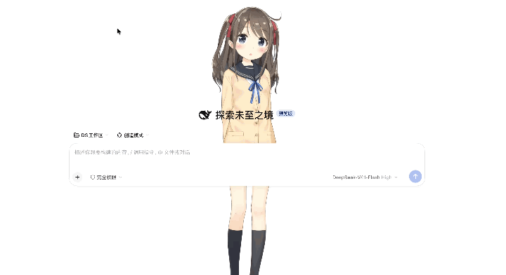

# 兴河桌宠（dsh-live2d-avatar）

DSH Web 界面的 Live2D 数字人插件。它以「兴河桌宠」的名字出现在侧边栏，作为独立 Agent 运行，
与用户正在工作的会话相互隔离。



## 安装

1. 打开 DSH 的 **设置 → 插件**；
2. 点右上角的 **「添加插件」**；
3. 在「包名或地址」里粘贴仓库地址：`https://github.com/lijiaxing1997/dsh-live2d-avatar`；
4. 点 **「安装」**，等它跑完；


## 功能

| 功能 | 说明 |
| --- | --- |
| 独立会话 | 桌宠有自己的会话、模型与思考档位，主会话零注入；上下文到阈值自动压缩，也能手动折叠 / 清空重来 |
| 两种形态 | 小窗常驻，或全屏分屏；功能条四个开关（开启 / 全屏 / 朗读 / 监测）各自独立 |
| 动作与表情 | 按回复内容自动播放动作 / 表情；别名逐个可配，菜单里标出「可播数量」 |
| 语音朗读 | Edge TTS（默认，开箱可用）或 MiniMax（自带 API Key）；按句流式合成，回复还没写完就开口 |
| 语音输入 | 按住麦克风说话，识别结果填进输入框；录的是 16kHz 单声道 WAV |
| 形象卡 | 显示大小 **50%–500%**、位置平移、3:4 封面；一组值随卡保存、随卡导出 |
| 导入本地模型 | 选一个 zip 或直接拖进来即可自动建卡；包里有 `xinghe.json` 就自动填好全部配置；同模型再导入算更新，误删可重新导入找回 |
| 社区模型兼容 | 导入时重算 `motion3.json` 的 `Meta` 计数、把带 `#` 的文件名改名并同步引用，避免「动作组找不到」 |
| 导出与分享 | 把一张卡的提示词、动作表情、大小位置、语音与封面打成一个 zip |
| 多形象 | 「我的」里管理多张形象卡，随时切换当前形象 |

## 开发架构

```
dsh-live2d-avatar/
├── index.js            宿主半边（ESM / Node）：路由、工具、形象卡库、语音合成、会话桥接
├── lib/                宿主侧模块：zip 解压与建卡、社区模型规整、Edge / MiniMax TTS、断句
├── client.js           浏览器半边（classic script）：React 界面、小窗 / 全屏、语音输入
├── src/live2d/         渲染器源码（TypeScript）
│   └── framework/      Live2D Cubism SDK for Web 5-r.4（原样引入）
├── assets/
│   ├── runtime.js      渲染器产物：esbuild 打包 src/live2d/viewer.ts
│   ├── Core/           Live2D Cubism Core
│   ├── models/         随包模型（Hiyori / Mao）
│   └── icon.png
├── presets/            桌宠自己的 Cordis preset（独立会话的声明）
├── cordis.patch.yml    宿主侧补丁：设置页 slot、路由、工具、系统提示词段落
├── docs/demo.gif       上面那张演示图
├── build.mjs           发行构建：打包出 dist/（压缩，宿主半边可再叠一层混淆）
└── tests/              回归测试
```


## 许可

安装与使用受[最终用户许可协议（EULA）](./LICENSE-EULA.md)约束

`assets/Core/**`、`assets/models/**` 与 `src/live2d/framework/**` 来自 Live2D Inc.，按 Live2D
自身的条款提供，见 [LICENSE-live2d.md](./LICENSE-live2d.md) 与 `assets/Core/LICENSE.md`。

